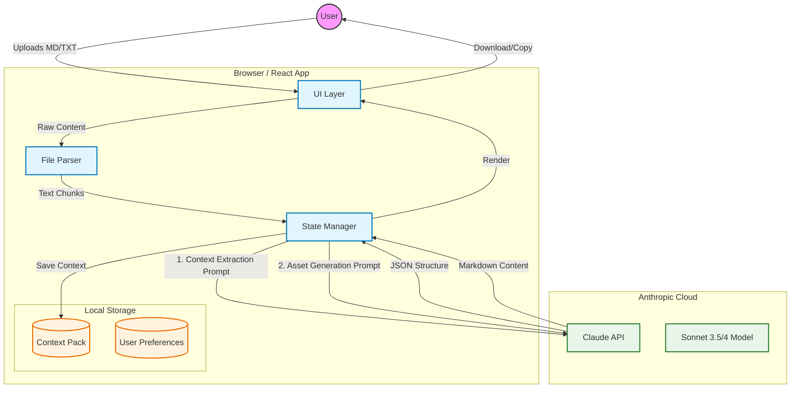

# 🚀 Commercial Kit Generator

[](https://claude.ai)
[](https://reactjs.org/)
[](https://www.typescriptlang.org/)
[](LICENSE)

> **⚡ AI-powered commercial materials generator that transforms your project documents into 9 professional marketing assets in minutes.**

**🔗 [Try it Live](https://claude.ai/public/artifacts/b19fd567-a2ea-4ed0-81f0-5fd25708d342)** • **Made by [Nuno Salvação](https://www.linkedin.com/in/nsalvacao/)**

---

## 🎯 What It Does

Upload your technical docs, business plans, or product specs → Get 9 professional commercial documents ready for sales and marketing.

| Category | Documents | Purpose |
|----------|-----------|---------|
| **💼 Sales** | One-Pager • Playbook • Battlecard | Arm sales teams with compelling narratives |
| **👔 Executive** | Pitch Deck • FAQ • ROI/TCO | Speak directly to decision-makers |
| **🔧 Technical** | Datasheet • Blueprint • Email | Bridge technical and business stakeholders |

### Who Benefits

**Founders & PMs** → Generate pitch materials from technical docs  
**Sales Teams** → Create consistent collateral without waiting for marketing  
**Solution Architects** → Build professional proposals rapidly  
**Startups** → Bootstrap go-to-market materials with limited resources

---

## 💡 Why Use This

| Before | After |
|--------|-------|
| Marketing takes days/weeks per asset | Generate 9 documents in minutes |
| Inconsistent messaging across teams | Consistent narrative everywhere |
| Technical docs aren't sales-ready | Proven frameworks (AIDA, SPIN) applied |
| High cost, slow iteration | Zero cost, instant iteration |

---

## 📚 Documentation & Resources

Detailed documentation covering the strategy, methodology, and technical architecture of the Commercial Kit Generator.

| Document | Description | Audience |
|----------|-------------|----------|
| **[📄 Project Summary](docs/Commercial%20Kit%20Generator%20-%20Project%20Summary.md)** | Executive overview of the project goals and scope. | Everyone |
| **[💎 Value Proposition](docs/Value%20Proposition%20-%20The%20Commercial%20Kit%20Generator%20for%20the%20Industrial%20SME%20COO.md)** | Deep dive into the specific value for Industrial SMEs. | Founders, Sales |
| **[🛡️ Methodology](docs/Framework%20Assurance%20&%20Methodology%20-%20Commercial%20Kit%20Generator.md)** | How we ensure quality using AIDA, SPIN, and other frameworks. | Product, Marketing |
| **[⚙️ Technical Report](docs/Technical%20Report%20-%20Commercial%20Kit%20Generator.md)** | In-depth look at the architecture, extraction pipeline, and stack. | Developers, CTOs |
| **[📊 Datasheet](docs/commercial-kit-generator-datasheet.md)** | Complete technical specifications and feature breakdown. | Technical Buyers |
| **[🚀 Go-to-Market Plan](Write%20Your%20Entire%20Go-to-Market%20Plan%20in%20Minutes.md)** | Strategic execution plan for launching this tool. | Founders, Strategy |

---

## 🏗️ Technical Stack

<details>
<summary><strong>🔎 View Architecture Diagram</strong></summary>


</details>

Built with **[Claude Artifacts](https://www.anthropic.com/claude)** by **[Anthropic](https://www.linkedin.com/company/anthropicresearch/)** — an interactive development environment within **[Claude AI](https://www.linkedin.com/showcase/claude/)** for rapid full-stack prototyping.

```
Frontend:       React 18 + TypeScript
Styling:        Tailwind CSS (glassmorphism design)
AI:             Claude Sonnet 4 API (internal calls)
State:          React Hooks (useState, useEffect)
Storage:        Browser Storage API
```

**Key Features:**
- 🔄 **Reactive prompts** — Parameters auto-update all document templates
- 🧠 **Smart extraction** — Two-phase AI pipeline structures unstructured docs
- 📋 **Framework templates** — AIDA, SPIN, C4, Message House built-in
- 🌍 **Bilingual** — Portuguese (PT-PT) & English
- 🎨 **Modern UI** — Dark theme, glassmorphism, AI aesthetics

> *For a deep dive into the architecture, extraction logic, and performance metrics, read the **[Technical Report](docs/Technical%20Report%20-%20Commercial%20Kit%20Generator.md)**.*

---

## 🚀 Quick Start

### 3 Steps to Complete Commercial Kit

```
1. Upload Documents (1-3 files: MD/TXT)
   → Business plans, specs, roadmaps, pitch notes

2. Generate Context Pack (AI extracts structured data)
   → Project name, tagline, problem/solution, features, metrics

3. Configure & Generate
   → Set ICP, persona, tone, language
   → Click "Generate" on any tab
   → Copy/download/regenerate
```

### Parameters

| Parameter | Options |
|-----------|---------|
| **ICP** | SaaS B2B • Industrial SME • Professional Services • Other |
| **Persona** | CEO/Founder • COO • Head CS • IT/Architecture • Other |
| **Tone** | Business-focused • Technical • Balanced |
| **Language** | Portuguese (PT-PT) • English |

**Pro Tip:** Switch to "Custom (Advanced)" to edit prompt templates. They auto-update when you change parameters!

---

## 📋 Document Frameworks

> *Based on proven sales methodologies. See our **[Framework Assurance & Methodology](docs/Framework%20Assurance%20&%20Methodology%20-%20Commercial%20Kit%20Generator.md)** for details on how we enforce quality.*

| Document | Framework | Output Structure |
|----------|-----------|------------------|
| **One-Pager** | AIDA + 3W | Problem → Solution → Benefits → Proof → CTA |
| **Pitch Deck** | Storytelling | 10 slides: Problem → Vision → Solution → Proof |
| **ROI/TCO** | 3 Scenarios | Assumptions → Impact Table (Small/Medium/Large) |
| **FAQ** | Thematic Q&A | Product • AI • Privacy • Regulation • Security • ROI |
| **Datasheet** | Vendor Style | Overview → Benefits → Features → Architecture → Specs |
| **Blueprint** | C4-Inspired | Scope → Principles → Containers → Data Flow → Security |
| **Playbook** | Message House + SPIN | ICP → Messaging → Discovery → Objections |
| **Battlecard** | Competitive Types | Generic Tools • Suites • Integrators • Status Quo |
| **Email** | First Contact | Subject variants → Problem → Solution → CTA |

---

## 🎨 UI Design

**Dark gradient** (slate→purple) • **Glassmorphism cards** • **Purple/pink gradients** • **Sparkles/lightning icons** • **Smooth transitions**

Built for an **AI-like modern aesthetic** with accessibility, proper contrast, and consistent spacing.

---

## 📝 Version History

| Version | Highlights |
|---------|-----------|
| **v2.0** (Current) | ✅ 9 document types • Reactive params • Custom prompts • Tagline extraction • Modern UI |
| **v1.0** (MVP) | ✅ One-Pager generation • Basic upload • Parameters • Copy/download |

---

## 🔮 Roadmap

**Phase 3 (Planned):**
- [ ] Preset management (save/load configs)
- [ ] PDF export
- [ ] Batch download (ZIP)
- [ ] Version history
- [ ] Rich Markdown rendering
- [ ] PDF/DOCX upload support

---

## 👨‍💻 Credits

**Built by:** Nuno Salvação  
**Email:** [nuno.salvacao@gmail.com](mailto:nuno.salvacao@gmail.com)  
**LinkedIn:** [linkedin.com/in/nsalvacao](https://www.linkedin.com/in/nsalvacao/)  
**GitHub:** [github.com/nsalvacao](https://github.com/nsalvacao)

**Powered by:**
- [Claude AI](https://www.linkedin.com/showcase/claude/) by [Anthropic](https://www.linkedin.com/company/anthropicresearch/)
- Claude Artifacts + Sonnet 4.5

---

## 🤝 Contributing

This is a **showcase project**. Feedback welcome!

**To provide feedback:**
1. [Try the live app](https://claude.ai/public/artifacts/b19fd567-a2ea-4ed0-81f0-5fd25708d342)
2. Open an issue on GitHub
3. [Connect on LinkedIn](https://www.linkedin.com/in/nsalvacao/)

---

## 📄 License

MIT License — free to learn from, adapt, or build upon this project.

```
Copyright (c) 2025 Nuno Salvação
```

---

## 🙏 Acknowledgments

Special thanks to **Anthropic** for Claude & Artifacts, and the open-source community for React, TypeScript, and Tailwind CSS.

---

## ⚖️ Legal Disclaimer & Acknowledgments

**1. No Affiliation**
This project is an independent open-source initiative and is **not** affiliated with, endorsed by, or sponsored by Anthropic, OpenAI, or any other technology provider mentioned. "Claude" and "Anthropic" are trademarks of Anthropic, PBC.

**2. Methodologies & Trademarks**
- **SPIN® Selling** is a registered trademark of Huthwaite International. This tool uses the framework structure for educational and generative purposes only.
- All other product names, logos, and brands cited herein are property of their respective owners and are used for identification purposes only.

**3. AI Content Disclaimer**
The materials generated by this tool are created by Artificial Intelligence and should be used as drafts or starting points. Users are responsible for reviewing, verifying, and editing all output before use in business contexts. The authors and contributors are not responsible for any inaccuracies, financial losses, or business outcomes resulting from the use of these documents.

---

**⚡ Made with AI by [Nuno Salvação](https://www.linkedin.com/in/nsalvacao/) • Transforming documents into deals**

[](https://claude.ai/public/artifacts/b19fd567-a2ea-4ed0-81f0-5fd25708d342)
[](https://www.linkedin.com/in/nsalvacao/)
[](https://github.com/nsalvacao)