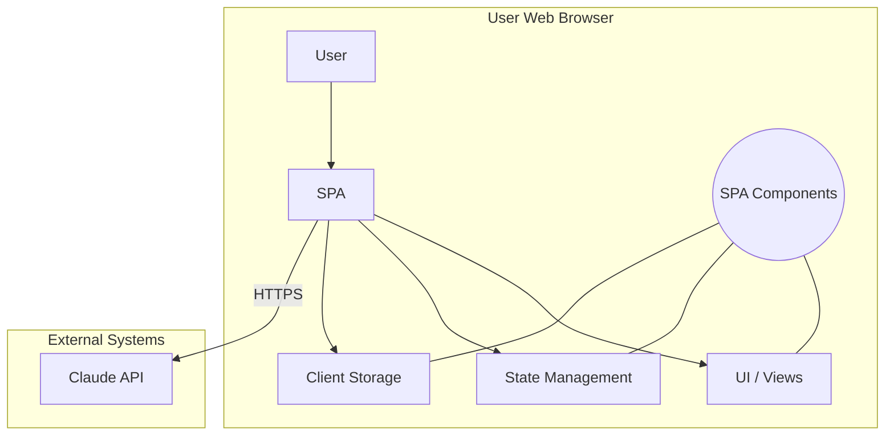

## 1.0 Executive Summary

The Commercial Kit Generator is an AI-powered platform designed to streamline and accelerate an organization's go-to-market strategy. It addresses the critical business challenge of translating detailed technical documentation into compelling, professional commercial assets. By automating this transformation, the system bridges the gap between product development and sales enablement, ensuring that commercial teams are equipped with accurate, consistent, and impactful materials from day one.

This system is an AI-powered document transformation tool developed for key business stakeholders, including Founders, Product Managers, Sales Teams, and Solution Architects. It solves the core problem of slow, inconsistent, and resource-intensive creation of sales and marketing collateral. By ingesting raw technical source documents, the platform leverages advanced AI to generate a comprehensive suite of sales-ready materials, applying proven commercial frameworks to ensure message discipline and effectiveness.

The Commercial Kit Generator produces nine primary document assets, logically grouped to serve distinct business functions. These outputs provide a complete toolkit for engaging prospects and stakeholders across the entire sales cycle.

- **Sales**
    - **One-Pager:** A concise, persuasive summary for initial outreach.
    - **Playbook:** A guide for sales teams on messaging, discovery, and objection handling.
    - **Battlecard:** A competitive analysis tool for positioning against market alternatives.
- **Executive**
    - **Pitch Deck:** A structured narrative for investor or executive presentations.
    - **FAQ:** A list of anticipated questions and answers for decision-makers.
    - **ROI/TCO Analysis:** A financial justification document modeling potential returns.
- **Technical**
    - **Datasheet:** A detailed technical overview for solution architects and IT professionals.
    - **Blueprint:** A high-level architectural document inspired by the C4 model.
    - **Email:** A templated asset for initial outreach (classified in the source as technical due to its templated nature, though functionally a sales asset).

This report provides a detailed analysis of the system's scope, architecture, functionality, and underlying technology stack.

--------------------------------------------------------------------------------

## 2.0 Scope & Non-Goals

Defining a system's boundaries is essential for managing expectations and ensuring successful implementation. This section delineates the precise capabilities of the Commercial Kit Generator (In-Scope) and explicitly identifies features that are not part of the current version (Non-Goals). This distinction clarifies the system's intended function and provides a clear view of its current operational envelope.

### In-Scope

The current version of the Commercial Kit Generator (v2.0) supports the following core functionalities:

- **Document Input:** Accepts up to three source documents in Markdown (`.md`) or plain text (`.txt`) formats.
- **Asset Generation:** Generates nine distinct commercial assets in Markdown format.
- **AI-Powered Extraction:** Utilizes a two-phase AI pipeline to intelligently extract and structure information from unstructured source documents into a `Context Pack`.
- **Dynamic Prompting:** Features a reactive prompt system where document templates automatically update in real-time based on user-selected parameters.
- **Customization:** Allows advanced users to directly edit and customize the underlying generation prompts.
- **Bilingual Support:** Generates documents in both Portuguese (PT-PT) and English.
- **Export Functionality:** Supports exporting generated documents via "Copy to Clipboard" and "Download as .md file".

### Non-Goals

The following functionalities are explicitly not part of the current system but are noted on the project roadmap for future consideration:

- **Expanded Input Formats:** The system does not currently support uploading documents in PDF or DOCX formats.
- **Advanced Export Options:** Generation of PDF files and batch downloading of all assets as a single ZIP archive are not implemented.
- **Configuration Management:** The ability to save and load preset parameter configurations is not available.
- **Rich UI Rendering:** The user interface does not render the generated Markdown with rich formatting (e.g., bold, headers); it displays the raw Markdown text.

This clear definition of scope sets the stage for understanding the system's workflow from the user's perspective.

--------------------------------------------------------------------------------

## 3.0 System Overview

From a user's perspective, the Commercial Kit Generator is designed as a streamlined, step-by-step workflow that guides the transformation of raw information into polished commercial assets. This section traces the end-to-end user journey, illustrating the logical flow from document input to the final, exportable output. The entire process is designed to be completed in minutes.

The primary user workflow consists of five distinct steps:

1. **File Upload** The user initiates the process by uploading source documents that describe the product or project. The system accepts files in Markdown (`.md`) or plain text (`.txt`) format, with a constraint of a maximum of three files per session.
2. **Context Extraction** After uploading the files, the user triggers the "Create Context Pack" action. This initiates an automated, AI-driven pipeline that reads the content of the uploaded documents and synthesizes it into a structured JSON object. This "Context Pack" serves as the single source of truth for all subsequent document generation steps.
3. **Parameter Selection** The user configures a set of key parameters to tailor the output to a specific audience and purpose. These parameters include the Ideal Customer Profile (ICP), target Persona, desired Tone, and output Language. An advanced "Custom" mode is available for users who wish to override the system's recommended prompt templates.
4. **Document Generation** With the Context Pack created and parameters set, the user selects one of the nine available document types (e.g., One-Pager, Pitch Deck) and initiates the generation process. The system combines the structured context with the user's parameters and a document-specific template to prompt the AI model, which then generates the final asset.
5. **Review & Export** The generated document is displayed to the user as raw Markdown text. In this final stage, the user can review the content for accuracy and completeness. The asset can then be exported for use in other systems via a "Copy to Clipboard" function or downloaded directly as a `.md` file.

This intuitive user journey is enabled by a client-centric architecture designed for privacy, security, and simplicity.

--------------------------------------------------------------------------------

## 4.0 Architecture

The Commercial Kit Generator is built upon a "client-side first" architectural philosophy. This strategic choice means that all core processing, data storage, and user interactions occur directly within the user's web browser. This approach significantly enhances data privacy by ensuring that sensitive source documents are never persistently stored on a server. It also simplifies deployment and reduces infrastructure dependencies, making the system highly portable and cost-effective.

### High-Level Components

The system is composed of several key components that work together within the browser environment:

- **UI / Views:** The user interface is a modern single-page application (SPA) built with **React 18** and **TypeScript**. This provides a type-safe, component-based structure that is both robust and maintainable. **Tailwind CSS** is used for styling, enabling a responsive and professional user experience.
- **State Management:** Application state, such as user selections and generated content, is managed locally using native **React Hooks**. This approach avoids the complexity of external state management libraries while providing efficient and predictable state control.
- **Client-Side Storage:** The application leverages the browser's native **Storage API** to persist the session's data (e.g., the Context Pack). This ensures user data remains on the client machine, aligning with the privacy-first design principle.
- **LLM Integration:** The system integrates with the **Anthropic Claude Sonnet 4 API** (specifically model version `claude-sonnet-4-20250514`) to perform its AI-driven extraction and generation tasks. All communication with the API occurs over secure HTTPS, ensuring data is encrypted in transit.
- **Export Layer:** Document export functionalities rely on standard, browser-native capabilities. The "Copy to Clipboard" feature uses the `navigator.clipboard` API, and file downloads are handled through dynamically generated object URLs.

### Architectural Diagram

The following diagram illustrates the system's high-level architecture, showing the interaction between the user, the browser-based application, and the external AI service.

This component-based architecture facilitates a dynamic and efficient flow of data, from raw user input to structured AI-generated output.

--------------------------------------------------------------------------------

## 5.0 Data Flow & Prompts

The core of the Commercial Kit Generator's intelligence lies in its data processing pipeline and sophisticated prompt engineering strategy. This section dissects the system's data flow, highlighting how it transforms unstructured textual input into structured, high-value commercial documents through a unique "two-phase extraction" process.

The data processing pipeline is executed in two distinct phases:

1. **Phase 1: Context Pack Creation** When the user uploads raw source documents (as plain text), the combined content is sent to the Claude API. This first API call is governed by a specific prompt that instructs the AI to analyze the text and extract key business and technical information. The output of this phase is a structured JSON object, referred to as the `ContextPack`. This object contains a comprehensive set of fields—`projectName`, `tagline`, `productOrSolution`, `problemSpace`, `targetCustomers`, `valueProposition`, `keyFeatures`, `technicalStack`, `metricsAndResults`, and `constraintsAndRisks`—creating a canonical, structured representation of the source material.
2. **Phase 2: Parameter-Driven Generation** Once the `ContextPack` is created, it serves as the foundation for generating the final documents. To create a specific asset (e.g., a Datasheet), the system populates a second, document-specific prompt template. This template dynamically incorporates data from the `ContextPack` JSON object alongside the user-selected parameters, such as `ICP`, `persona`, `tone`, and `docLanguage`. This combined, highly contextualized prompt is then sent to the Claude API to generate the final Markdown output.

### Reactive Prompt Mechanics

A key feature of the system is its use of "reactive prompts." The prompt templates used in Phase 2 are not static; they are dynamically updated in the user interface in real-time as the user modifies parameters like Persona or Tone. This allows advanced users to see precisely how their selections will influence the AI's instructions before committing to a generation request, providing a powerful layer of transparency and control.

### System Inputs

The system distinguishes between required and optional user inputs to function correctly.

- **Required:**
    - **Source Document Upload:** At least one source document (`.md` or `.txt`) must be provided for the system to create a Context Pack.
    - **Generation Parameters:** While all parameters (`ICP`, `persona`, etc.) have default values, they are implicitly required as their values are injected into every generation prompt.
- **Optional:**
    - **Custom Prompt Editing:** The "Custom (Advanced)" mode is an optional feature that allows users to override the system's recommended, pre-built prompt templates with their own custom instructions.

This logical data flow is executed by a carefully selected set of modern web technologies.

--------------------------------------------------------------------------------

## 6.0 Technology Stack & Dependencies

This section provides a clear, layer-by-layer inventory of the technologies, frameworks, and services that constitute the Commercial Kit Generator. The stack is intentionally lean and modern, prioritizing client-side performance, developer experience, and data privacy.

### Technology Stack

|   |   |   |
|---|---|---|
|Layer|Technology/Service|Purpose|
|**Frontend**|React 18, TypeScript|For building a type-safe, component-based, and performant user interface.|
|**Styling**|Tailwind CSS|A utility-first CSS framework for rapidly building a modern, responsive UI.|
|**State Management**|React Hooks|For managing local component and application state without external libraries.|
|**AI Integration**|Anthropic Claude Sonnet 4 API|The core large language model used for content extraction and document generation.|
|**Storage**|Browser Storage API|For client-side data persistence, enhancing privacy by avoiding server storage.|

### Key Dependencies

For the application to function correctly, the following external dependencies must be met:

- **Modern Web Browser:** A recent version of a major web browser (e.g., Chrome 90+, Firefox 88+, Safari 14+) with JavaScript enabled is required.
- **Stable Internet Connection:** A reliable internet connection is necessary for communication with the external Anthropic Claude API.
- **Claude API Access:** The application must be able to make secure HTTPS requests to the Anthropic Claude API endpoints. This may require network policy adjustments in enterprise environments.

These technologies work in concert to deliver the system's powerful functional capabilities.

--------------------------------------------------------------------------------

## 7.0 Functional Capabilities

The true value of the Commercial Kit Generator lies in the strategic intent behind each of its nine generated documents. This section maps each asset to its specific commercial purpose and the underlying strategic framework it employs. This provides insight not just into _what_ the system produces, but _why_ each asset is structured the way it is.

|   |   |   |
|---|---|---|
|Generated Document|Commercial Intent & Framework|Expected Output Structure|
|**One-Pager**|Provides a concise, high-impact summary to capture initial interest.  _Framework: AIDA + 3W_|Problem → Solution → Benefits → Proof → Call to Action (CTA).|
|**Pitch Deck**|Delivers a compelling narrative for executive and investor buy-in.  _Framework: Storytelling Arc_|A 10-slide structure covering Problem → Vision → Solution → Proof.|
|**ROI/TCO**|Justifies investment by modeling financial impact for decision-makers.  _Framework: 3-Scenario Analysis_|Assumptions → Impact Table (Small/Medium/Large Scenarios) → TCO Inclusions.|
|**FAQ**|Proactively addresses common executive and technical concerns.  _Framework: Thematic Q&A_|Questions organized by theme: Product, AI, Privacy, Regulation, Security, ROI.|
|**Datasheet**|Offers a detailed technical overview for IT and architecture personas.  _Framework: Vendor Style_|Overview → Benefits → Features → Architecture → Technical Specifications.|
|**Blueprint**|Communicates the high-level system architecture to technical stakeholders.  _Framework: C4-Inspired_|Scope → Principles → Containers → Data Flow → Security Hooks.|
|**Playbook**|Equips sales teams with a structured guide for engaging prospects.  _Framework: Message House + SPIN_|ICP Definition → Messaging Pillars → Discovery Questions → Objection Handling.|
|**Battlecard**|Arms sales teams to effectively position against different competitor types.  _Framework: Competitive Types_|Analysis of Generic Tools, Big Suites, Custom Integrators, and the Status Quo.|
|**Email**|Provides a template for effective initial outreach to target personas.  _Framework: First Contact_|Subject variants → Problem Framing → Solution Introduction → Clear CTA.|

These functional capabilities are underpinned by a security and privacy model designed for enterprise environments.

--------------------------------------------------------------------------------

## 8.0 Security, Privacy & Compliance

Security and data privacy are paramount, especially when processing potentially sensitive business and technical documents. The Commercial Kit Generator's architecture is fundamentally designed to address these concerns. This section evaluates the system's security posture, which is rooted in its client-side first approach.

The system's approach to key security and privacy domains is as follows:

- **Data in Transit:** All communication between the user's browser and the external Claude API is encrypted using **TLS 1.3**, the current standard for secure web communication.
- **Data at Rest:** Source documents and generated content are **not stored on any server**. Data is persisted exclusively within the client-side **Browser Storage API**, governed by the security sandbox of the user's web browser.
- **Data Retention:** As a consequence of the client-first architecture, data retention is controlled entirely by the user's browser session. Closing the browser tab or clearing site data effectively removes all processed information from the system.
- **Access Control:** The base system does not implement server-side user authentication. The documentation notes that enterprise Single Sign-On (SSO) is achievable "through standard web authentication flows," but no specific implementation details are provided.

### Enterprise Considerations

For adoption within an enterprise environment, the source documentation recommends two key actions:

1. Establishing a network policy that explicitly allows outgoing HTTPS traffic to the Anthropic Claude API endpoints.
2. Conducting an internal IT security review to ensure the application's data processing workflows align with corporate data governance and security policies.

### Compliance

The system is described with the following compliance characteristics:

- **GDPR-compliant data processing:** The client-side architecture inherently supports GDPR principles by minimizing data retention and avoiding server-side storage of user documents.
- **AI Act consideration:** The design takes into account the need for transparency in automated systems.

This security model provides the foundation for a reliable and performant user experience.

--------------------------------------------------------------------------------

## 9.0 Performance & Reliability

This section assesses the system's performance characteristics and potential failure modes. As a client-side application that depends on an external API, its performance is heavily influenced by the user's local environment and network conditions.

### Performance Metrics

The system's technical datasheet specifies the following performance targets:

- **Document Processing:** `<30 seconds` for typical technical documents to be parsed and have a `Context Pack` created.
- **Asset Generation:** All 9 documents can be generated in `<2 minutes`.
- **UI Responsiveness:** User interface interactions are designed to complete in `<100ms`.

### System Constraints

Performance is primarily constrained by factors outside the application's direct control:

- **Browser Capabilities:** The performance of the user's web browser and the resources available on their machine can impact processing speed.
- **Internet Connection:** A stable and reasonably fast internet connection is critical for the API calls to the Claude service.

### Failure Modes

Based on the system's design and source code, the following failure modes are possible:

- **File Upload Error:** An error is triggered if the user attempts to upload more than three files simultaneously.
- **API Call Failure:** The API call to the Claude service may fail due to network errors, an invalid API key, or issues with the external service itself.

### Reliability Mechanisms

Based on the provided source materials, explicit reliability mechanisms such as automated retries for failed API calls or configurable timeouts are **Not specified**. The system currently relies on displaying an error message to the user in the event of a failure.

### Practical Recommendations

To ensure stable and performant operation, users are advised to:

- Use a modern, up-to-date web browser.
- Ensure a stable and reliable network connection before initiating AI-driven processes.
- Keep source document sizes reasonable to optimize processing time.

From performance, the report now turns to the crucial aspects of observability and cost management.

--------------------------------------------------------------------------------

## 10.0 Observability & Cost Control

For any system leveraging third-party AI services, observability and cost management are critical operational concerns. This is particularly true in a production environment where API usage translates directly to operational expenditure. This section distinguishes between the capabilities implemented in the current showcase project and the recommended practices for a full-scale production deployment.

### Implemented Capabilities

As a showcase project, the system's observability is focused on client-side development and debugging:

- **Performance Monitoring:** The system relies on standard browser-based tools, such as **React DevTools**, for monitoring component performance and debugging the user interface.
- **Error Tracking:** Error handling is implemented at the client level. When an operation fails (e.g., an API call), an error message is displayed directly to the user in the UI.

### Production Recommendations

For a production-grade deployment, a more robust observability strategy would be essential. While these features are not currently implemented, the following metrics should be tracked:

- **Latency:** The duration of API calls to the Claude service, measured at key percentiles (p50, p90, p95), to monitor performance.
- **Token Usage:** The number of input and output tokens consumed per generation request to accurately track and forecast costs.
- **Error Rates:** The percentage of failed API requests, categorized by document type or error reason, to identify systemic issues.
- **Per-Document Cost:** A calculated metric derived from token usage to understand the cost associated with generating each type of asset.

### Logging

A specific logging schema or strategy for capturing operational data is **Not specified** in the source materials.

These operational considerations are closely tied to how the system is deployed and integrated into an organization's existing toolchain.

--------------------------------------------------------------------------------

## 11.0 Deployment & Integration Options

The Commercial Kit Generator's architecture as a single-page application (SPA) dictates a straightforward and flexible deployment model. This section outlines the standard deployment pattern for the system and explores its potential for integration within broader enterprise ecosystems.

### Deployment Assumptions

The application is designed to be deployed as a set of static files (HTML, CSS, JavaScript). The standard deployment model involves placing these compiled assets on a static web server or a Content Delivery Network (CDN). This approach is highly scalable, secure, and cost-effective, as it eliminates the need for managing a dedicated server-side application environment.

### Integration Patterns

The system's web-native design allows for several potential integration points with existing enterprise tools:

- **Authentication:** The technical datasheet claims that enterprise Single Sign-On (SSO) integration is possible "through standard web authentication flows." However, specific implementation details or required protocols (e.g., SAML, OIDC) are **Not specified**.
- **Internal Portals:** As a web application, the generator can be easily embedded within internal company portals, wikis, or other toolkits using standard web technologies like an `<iframe>`. This allows the tool to be presented alongside other internal resources. Specific APIs for deeper integration are **Not specified**.

Understanding deployment leads to a final analysis of the system's inherent limitations and the risks associated with its operation.

--------------------------------------------------------------------------------

## 12.0 Limitations, Risks & Mitigations

A thorough analysis of any system requires a clear-eyed assessment of its inherent limitations and operational risks. Understanding these factors is crucial for successful adoption, setting appropriate user expectations, and establishing best practices for operation. This section identifies the key risks associated with the Commercial Kit Generator and outlines the mitigation strategies embedded in its design.

|   |   |   |
|---|---|---|
|Limitation / Risk|Impact|Mitigation Strategy|
|**LLM Hallucination**|The AI model may generate factually incorrect or misleading information that was not present in the source documents, potentially leading to inaccurate commercial materials.|The system's two-phase pipeline is designed to mitigate this by first creating a structured `ContextPack` directly from the source. Subsequent prompts are heavily constrained by this context, reducing the model's freedom to invent information.|
|**Input Document Quality Dependency**|The quality and value of the nine generated assets are directly proportional to the clarity, accuracy, and completeness of the uploaded source documents. "Garbage in, garbage out."|The recommended enterprise setup includes user training on how to prepare comprehensive and well-structured source materials to ensure high-quality outputs.|
|**Prompt Drift**|Future updates to the underlying Claude language model by Anthropic could alter its behavior, causing the existing prompts to produce different or lower-quality outputs over time.|The system mitigates this risk by pinning its API calls to a specific model version (`claude-sonnet-4-20250514`). This ensures consistent and predictable behavior until a deliberate decision is made to upgrade and re-validate prompts.|

These current limitations are directly addressed by the system's planned future improvements.

--------------------------------------------------------------------------------

## 13.0 Roadmap & Next Improvements

This section outlines the planned future enhancements for the Commercial Kit Generator, based directly on the official project roadmap. These features are designed to address some of the current system's limitations and expand its capabilities to better serve enterprise use cases.

### Phase 3 (Planned)

The following features are grouped under the "Phase 3" plan. While they are presented as a collection of planned work, the source material does not assign individual priorities or timelines to these items.

- Preset management (save/load configs)
- PDF export
- Batch download (ZIP)
- Version history
- Rich Markdown rendering
- PDF/DOCX upload support

This roadmap indicates a clear direction for the project's evolution, focusing on improved usability, expanded format support, and richer user experience.

--------------------------------------------------------------------------------

## 14.0 Appendix

This appendix provides a collection of reference materials for key terms and parameters used throughout the report, ensuring clarity and consistency.

### A. Glossary of Terms

**Context Pack**: A structured JSON object that is automatically extracted from the user's raw source documents by the first phase of the AI pipeline. It serves as the single source of truth for all subsequent document generation.

**Reactive Prompts**: The dynamic prompt templates used for document generation. These templates automatically update in the user interface in real-time as a user changes configuration parameters like Persona or Tone.

**Two-Phase Extraction**: The core data processing pipeline of the system. Phase 1 involves structuring raw, unstructured content into a `ContextPack`. Phase 2 uses that structured `ContextPack` along with user parameters to generate the final document.

### B. System Parameters

The following table lists the user-configurable parameters that control the focus and tone of the generated documents.

|   |   |
|---|---|
|Parameter|Available Options|
|**ICP**|SaaS B2B, Industrial SME, Professional Services, Other|
|**Persona**|CEO / Founder, COO / Operations, Head CS, IT / Tech, Other|
|**Tone**|Business-focused, Technical, Balanced|
|**Language**|Portuguese (PT-PT), English|